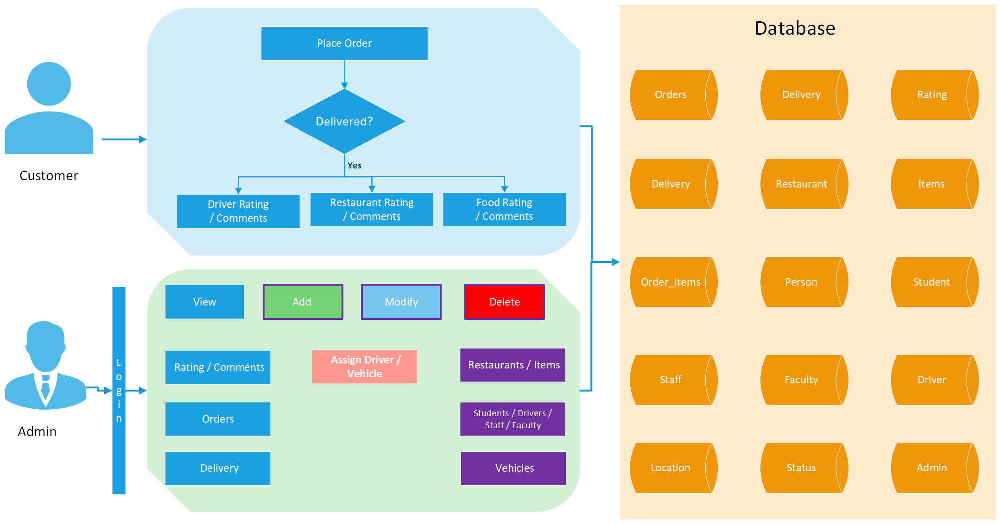
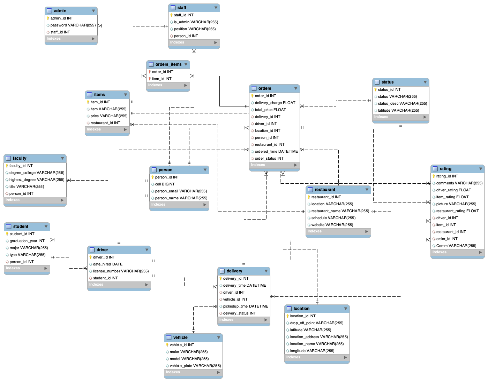
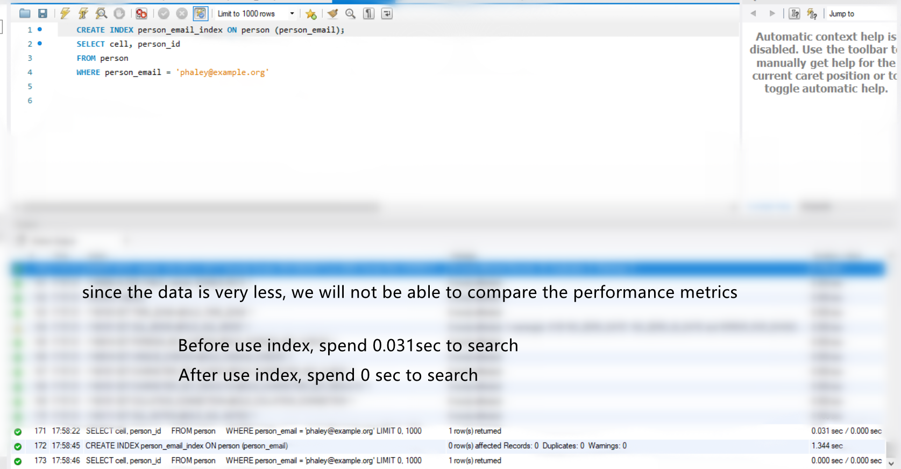
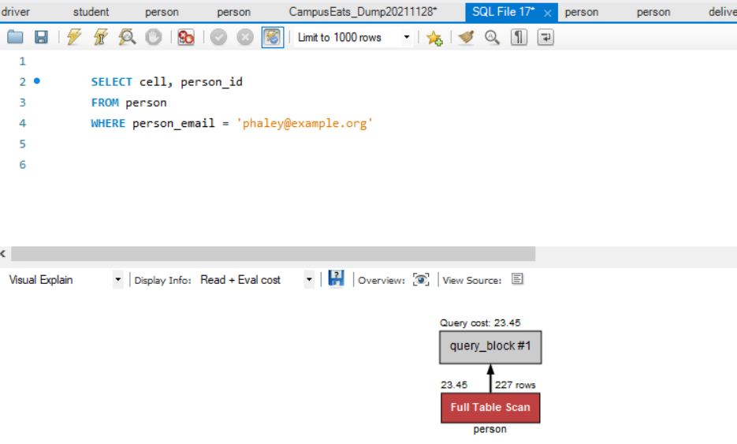
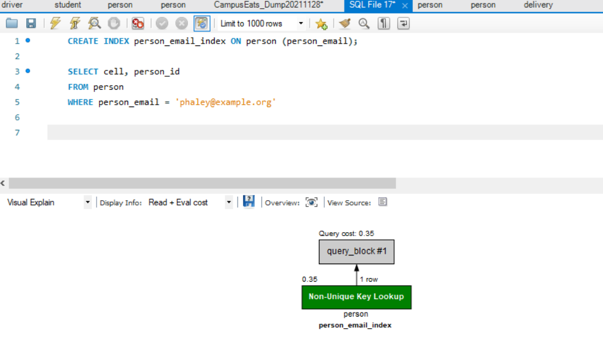

## Campus Eats (Fall-2021)
This project is based on Campus Eats database dump , further adds a rating system allows customers of Campus Eats to rate both food and drivers and a login enabled administrator who can make CRUD operations over all the tables.

## Team Members

Raju Challagundla

Yuehan Lan

Sumanta Bhattacharyya

Zihui Wang

## Project Introduction

With the threat of the Corona virus, food delivery services are more important than ever.Local restaurants are eager to find easy ways to have food delivered to customers without having to hire delivery employees. Even when things return to normal, many experts feel that food delivery will be something that we all will have become accustomed to as a part of our regular activites (even more than before).  

Students love food delivery services on campus.  Campuses do not like the steady stream of visitors that may or  may not have a formal connection with the university.  Companies such as UberEats and GrubHub are happy to deliver on campus, but many schools are wondering if they should take control of the delivery and ensure that students and authorized university employees are the only ones delivering food on campus for safety and health reasons.

We study the data and food delivery service website/app to enhancing the database.

## Business Rules
1. Persons who are approved can only be the drivers.
2. Only students may be drivers.
3. Food can only be delivered to the approved locations 
4. There is a flat fee of $5 for each delivery.
5. Include approved Food providers or restaurants
6. Max offerings by a restaurent is 10.
7. Orders can only be from one restaurant and from one person only
8. A customer can rate the foold only one time per order
9. A customer can rate the delivery only one time per order
10. Rating scale is between 1 to 5.
11. Administrators can will have access over all the data through the WebUI.
12. A restaurant can have many menu items. Each menu item only offered from one restaurant.

## Architecture / Use Case for Rating System

1. Customers provide ratings after delivery of an order.
2. Customers may provide ratings / comments / upload a photo of a driver
3. Customers may provide ratings / comments / upload a photo of a restaurant
4. Customers may provide ratings / comments / upload a photo of a food item
5. Customers may search for ratings on a particular restaurant.
6. Administrators of the system can view driver ratings, Item ratings and restaurant ratings.

## EERD

## Data Dictionary

				
[Click here](docs/DataDictionary_Final.pdf)

## Stored procedures

Database users who retrieve updated records daily or repeatedly throughout the week/month use stored procedures to simplify this task. Stored procedures are SQL code that is saved to a file and accessed via a call procedure. To execute the query, a user calls the procedure and specifies a parameter that the underlying SQL query then executes. Thereby, stored procedures allow users to save time and increase efficiency by eliminating the need to re-write SQL code.

Below are few examples which illustrates the usage of stored procedures.

  
**1) To get total orders delivered per driver.** 
<pre>

DROP PROCEDURE IF EXISTS no_of_orders_delivered_by_driver;

DELIMITER //

CREATE PROCEDURE no_of_orders_delivered_by_driver(IN driver_id INT, OUT total INT)

BEGIN
	
	SELECT count(*) INTO total 
	
	FROM driver dr, delivery de 
	
	WHERE dr.driver_id = de.driver_id AND dr.driver_id = driver_id AND de.delivery_time IS NOT NULL;

END //

DELIMITER ;

CALL no_of_orders_delivered_by_driver(1,@total);

SELECT @total;

   </pre>

**2)  To get Sum of total purchase by restaurant.**

<pre>

DROP PROCEDURE IF EXISTS sum_total_by_restaurant;

DELIMITER //

CREATE PROCEDURE sum_total_by_restaurant( IN res_id INT, OUT sumtotal FLOAT)

BEGIN
	
	SELECT SUM(total_price) INTO sumtotal
	
	FROM Campus_Eats_Fall2021.order ord where ord.restaurant_id = res_id;
 
END //
 
DELIMITER ;

CALL sum_total_by_restaurant(5, @sumtotal);

SELECT ROUND(@sumtotal,2);
</pre>
**3) Display the max, min and average ratings for each feature when given a restaurant ID for all orders for that restaurant**
<pre>
DROP PROCEDURE IF EXISTS min_max_avg_restaurant_rating;

-- Change statement delimiter from semicolon to double front slash
DELIMITER //
CREATE PROCEDURE min_max_avg_restaurant_rating ( in res_id int, out min_rest_rating float, out max_rest_rating float, out avg_rest_rating float)
-- declare parameter within stored procedure
-- (
--  @l_id int , 
--  @min_rest_rating float output
--  @max_rest_rating float output
--  @avg_rest_rating float output
-- )
BEGIN
  -- DECLARE sum_number_order INT; -- declare variable to be used during execution of stored procedure

  SELECT MIN(restaurant_rating) 
  INTO min_rest_rating
  -- the result will be placed in this variable sum_balance_due_var
  FROM  CampusEats_Fall_2021.rating
  WHERE restaurant_id = res_id; 
  
  SELECT MAX(restaurant_rating) 
  INTO max_rest_rating
  -- the result will be placed in this variable sum_balance_due_var
  FROM  CampusEats_Fall_2021.rating
  WHERE restaurant_id = res_id; 
  
  SELECT AVG(restaurant_rating) 
  INTO avg_rest_rating
  -- the result will be placed in this variable sum_balance_due_var
  FROM  CampusEats_Fall_2021.rating
  WHERE restaurant_id = res_id; 

  -- Change statement delimiter from semicolon to double front slash
END //
DELIMITER ; 

set @res_id=3;
CALL min_max_avg_restaurant_rating(@res_id, @min_rest_rating, @max_rest_rating, @avg_rest_rating);
select Round(@min_rest_rating, 3), Round(@max_rest_rating, 3), Round(@avg_rest_rating, 3);
</pre>
**4) Display a count of the orders made by a customer for a specified date range when given a customer id**
<pre>
DROP PROCEDURE IF EXISTS total_order_customer

-- Change statement delimiter from semicolon to double front slash
DELIMITER //
CREATE PROCEDURE total_order_customer ( in cus_id int, in timea VARCHAR(100), in timeb VARCHAR(100), out total_order int)
-- declare parameter within stored procedure
-- (
--  @cus_id int , 
--  @total_order int
-- )
BEGIN
  -- DECLARE sum_number_order INT; -- declare variable to be used during execution of stored procedure

  SELECT COUNT(*)
  INTO total_order
  -- the result will be placed in this variable sum_balance_due_var
  FROM  CampusEats_Fall_2021.orders
  WHERE person_id = cus_id AND ordered_time BETWEEN timea AND timeb;
  -- Change statement delimiter from semicolon to double front slash
END //
DELIMITER ; 

set @cus_id=2, @timea='2021-11-15 09:30:00', @timeb='2021-11-17 10:45:33';
CALL total_order_customer(@cus_id, @timea, @timeb, @total_order);
select ROUND(@total_order,2);
</pre>
## Views and Functions
**View**

Views in SQL are kind of virtual tables. Like a table, a view consists of a set of named columns and rows of data. Unless indexed, a view does not exist as a stored set of data values in a database. The rows and columns of data come from tables referenced in the query defining the view and are produced dynamically when the view is referenced. A view is a SQL statement that is stored in the database with an associated name. 

1) Display total price of the orders by each customer (distinct) for a specified date range
<pre>
create view total_spending_per_person as SELECT round(sum(orders.total_price), 2) as total_spending, person.person_id, orders.ordered_time FROM `orders`, `person` where orders.person_id = person.person_id and orders.ordered_time between '2021-01-01' and '2022-12-31' GROUP by (orders.person_id);
</pre>

since from UI perspective, it is required to provide start and end date from user input so it is better to have a ***stored procedure*** for this view.

<pre>
DELIMITER $$
CREATE PROCEDURE GetResturnatRatings(
	IN  RID INT
)
BEGIN
	SELECT * FROM `total_spending_per_person` where person_id = PID and ordered_time between StartDate and EndDate;
END$$
DELIMITER ;
</pre>

2) display the max, min and average ratings for each feature when given a restaurant ID for all orders for that restaurant.

<pre>
create view resturant_ratings as select min(rating.restaurant_rating) as min_rating, max(rating.restaurant_rating) as max_rating, round(avg(rating.restaurant_rating), 2) as avg_rating, restaurant.restaurant_name, restaurant.restaurant_id from restaurant, rating where restaurant.restaurant_id = rating.restaurant_id group by (restaurant.restaurant_id);
</pre>

3) Persons who are approved can only be the drivers.
<pre>
create view approved_driver as select driver.date_hired, driver.license_number, rating.driver_rating, student.student_id, person.person_name from rating, student, person, driver where student.student_id = driver.student_id and person.person_id = student.student_id and driver.driver_id = rating.driver_id;
</pre>

4) who is going to deliver, where is it getting delivered,delivered or not, which vehicle driver is using, from which restaurant, items under the order
<pre>
create view required_table as select orders.order_id, orders.	total_price, driver.license_number, location.location_address, status.status_desc, vehicle.model, restaurant.restaurant_name, items.item, person.person_name from driver, orders, location, status, delivery, vehicle, restaurant, orders_items, items, person, student where orders.driver_id = driver.driver_id and orders.location_id = location.location_id and delivery.delivery_status = status.status_id and status.status_id = 4 and delivery.driver_id = driver.driver_id and delivery.vehicle_id = vehicle.vehicle_id and restaurant.restaurant_id = orders.restaurant_id and orders.order_id = orders_items.order_id and items.item_id = orders_items.item_id and student.person_id = person.person_id and driver.student_id = student.student_id;
</pre>

**Function**
Database users who retrieve updated records daily or repeatedly throughout the week/month use functions to simplify this task. Functions are SQL code that is saved to a file and accessed via a select statement. To execute the function, a user uses the select statement and specifies the parameters that the underlying SQL query then executes. Thereby, functions allow users to save time and increase efficiency by eliminating the need to re-write SQL code.

2) Display a particular customer’s rating for a restaurant
<pre>
DELIMITER $$
CREATE FUNCTION customer_rating_for_restaurant( cus_id INT, res_id INT)
RETURNS FLOAT
DETERMINISTIC
BEGIN 
	DECLARE avg_customer_rating_for_restaurant FLOAT;	
	SELECT ROUND(avg_restaurant_rating, 2) INTO avg_customer_rating_for_restaurant
	FROM  
		(SELECT AVG(rating.restaurant_rating) AS avg_restaurant_rating, rating.order_id, ord.person_id, rating.restaurant_id
		FROM  CampusEats_Fall_2021.rating AS rating
		INNER JOIN CampusEats_Fall_2021.orders AS ord
		ON rating.order_id = ord.order_id
		where ord.person_id = cus_id AND rating.restaurant_id = res_id
    -- where person_id=2
		group by  order_id, rating.restaurant_id) as avg_rest_rating;
	RETURN avg_customer_rating_for_restaurant;
END $$
DELIMITER ;

SELECT  customer_rating_for_restaurant(2, 9) 

</pre>

## Indexes and indexing: speed up search run time
An Index is a data structure that contains a copy some of the data from one or
more existing database tables
An Example (conceptually) : An index at the back of the textbook.
- A DB index provides an organizational framework that the DBMS can use to
quickly locate the information that it needs.
- The single most critical tool for improving database performance.

Without an index, the DBMS has to perform a table scan inorder to perform a desired
rows.Indexes are created on one or more columns in a table and can be created on most but not all columns and it depends on the column type. Ex: type : text , index cannot be created without employing additional mechanisms like hash algorithms, creating an index increases the amount of storage required by the database as it stores a copy of some of the data in the table.

Because the primary key and foreign key already have index, we only need add index to the data which needs to search frequent and special, and not search by id.

Before we have index, the search will scan full table, it will spend much more time.

After create index, the search changed to non-unique key look up, and search time is sharp drop.

## Springboot Web/App Implementation

The web application is built using Springboot-2.5.6 which also uses thymeleaf as html template engine and authentication is handled through spring web security. You can download [source code and instructions to setup from here](https://github.com/Raju-Challagundla/CampusEats-Backoffice).

This web application allows an administrative user to manage entries in the different (Refer to above architecture Diagram) tables of the database. Appication uses below tables to authenticate the administrative user
- Person (col: person_email)
- Staff (col: is_admin = Y)
- Admin (col: encrypted password)

And once authentication is successful then a session gets started which ensures the protection of the urls that is used within the application until logout happens; only authorized users can access the application's Create-Read-Update-Delete (CRUD) functionality.

An authenticated administrator has the ability to view 
- Orders
- Deliveries
- Students / Drivers
- Restaurants
- Food Items
- Vehicles
- Ratinng of Drivers / Restaurants / Food Items.
	
An authenticated administrator has the ability to add new, update , delete existing 
- Students / Drivers
- Restaurants
- Food Items
- Vehicles

New users (who will have administrative privileges) can only be added by a previously authenticated user. Once added, new user will be able to login as administrator and be able to to perform the the previleged functionalities.

#### Screenshots of the CampusEats Backoffice (CRUD)

[Login](screenshots/1-Login-Admin.png) | [Home](screenshots/2-Home.png) | [Add Adminstrator](screenshots/3-AddAdmin.png) | [Retrieve Students](screenshots/4-ListStudents.png) | [Add Student](screenshots/6-AddStudent.png) | [Update Student](screenshots/7-UpdateStudent.png) | [Retrieve Restaurants](screenshots/8-ListRestaurants.png) | [Add Restaurant](screenshots/9-AddRestaurant.png) | [Update Restaurant](screenshots/10-UpdateRestaurant.png) | [Retrieve Orders](screenshots/11-ListOrders.png) | [Retrieve Deliveries](screenshots/12-ListDeliveries.png) | [Manage Delivery](screenshots/13-ManageDelivery.png) | [Retrieve Food Items](screenshots/14-ListFoodItems.png) | [Add Food Item](screenshots/15-AddFoodItem.png) | [AddFoodItemsByRestaurants](screenshots/16-AddFoodItemsByRestaurants.png) | [Update Food Item](screenshots/17-UpdateFoodItem.png) | [Retrieve Vehicles](screenshots/18-Listvehicles.png) | [Add Vehicle](screenshots/19-AddVehicle.png) | [Update Vehicle](screenshots/20-UpdateVehicle.png)

#### Future Work
Though the current The web administration interface supports most of the databases tables for CRUD operations but it still can be expanded to manage different functionalities like Sorting and Searching through different fields and may need to additional columns to support this feature for ex: a column to store zip code.

## MySQL Database Dump

[Complete Database Dump](sql/CampusEatsDump_20211130.sql)

#### Screenshots of Populated Database Tables:
[Person table](screenshots/1-Person.png) |[Student table](screenshots/2-Students.png) |[Driver table](screenshots/5-Driver.png) | [Faculty table](screenshots/6-faculty.png) |[Ratings table](screenshots/11-Ratings.png) |[Orders table](screenshots/9-orders.png) | [Delivery table](screenshots/4-Delivery.png) |[Location table](screenshots/8-location.png) |[Restaurant table](screenshots/12-Restaurants.png) |[Staff table](screenshots/13-Staff.png) |[Vehicle table](screenshots/15-Vehicles.png) |[Order Items table](screenshots/10-ItemsByOrder.png) |[Status table](screenshots/14-Status.png)

 
## Summary PPT

[Summary PPT](https://docs.google.com/presentation/d/1PkoQmjHqariVjEWBmVJjWyUFxWfx6AOzss4paKI14dE/view)

